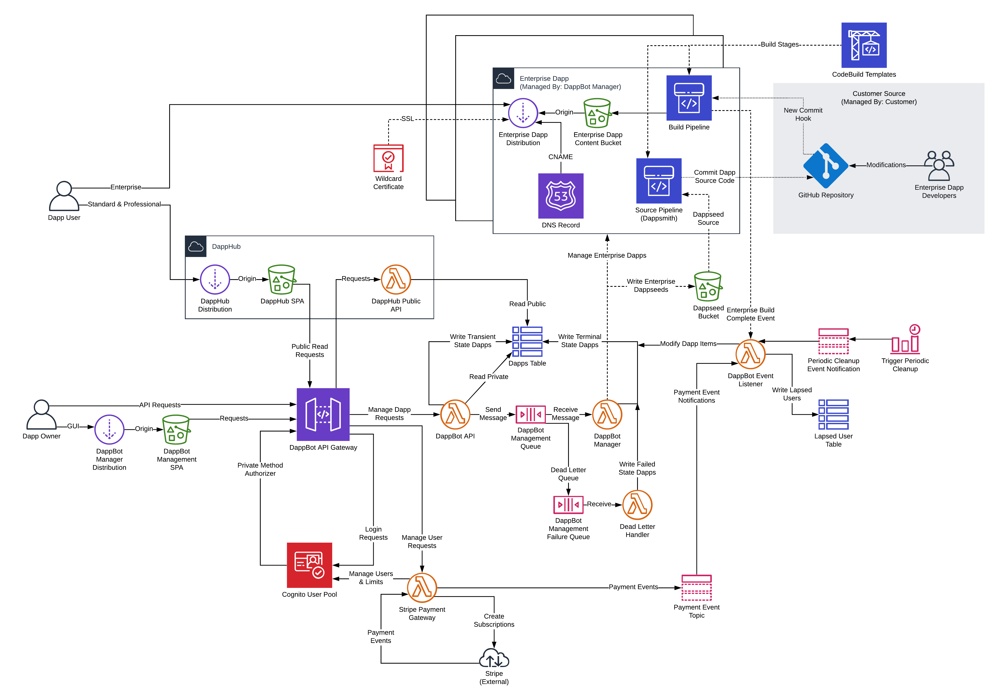

# Project: DappBot
[DappBot App](https://dapp.bot/)

A serverless application for generating frontends for Ethereum-based dapps
* Allows users to generate a Dapp hosted as a static site on aws infrastructure in 5 minutes from a contract ABI
* Uses a completely serverless architecture to allow effortless scaling and cost control
* Uses a [React App](https://reactjs.org/) to display a Dapp frontend on [DappHub](https://hub.dapp.bot/) based on a user provided [Solidity ABI](https://solidity.readthedocs.io/en/develop/abi-spec.html), contract address, and selected blockchain network
* Integrates with [Metamask](https://metamask.io/) and [Vault Guardian](https://github.com/Lsquared13/guardian-project) for submitting write transactions to the blockchain

## Architecture

[Diagram File](architecture-diagram.png)

## Repositories

### Infrastructure

* [Terraform Infrastructure](https://github.com/Lsquared13/terraform-aws-dappbot)

### Typescript Types

* [DappBot Types](https://github.com/Lsquared13/dappbot-types)
* [API Types](https://github.com/Lsquared13/api-types)

### Clients

* [API Client Library](https://github.com/Lsquared13/dappbot-api-client)
* [React Web App](https://github.com/Lsquared13/dappbot-management-spa)
* [CLI](https://github.com/Lsquared13/dappbot-cli)

### Lambda Functions

* [API](https://github.com/Lsquared13/dappbot-api-lambda)
* [Stripe Payment Gateway](https://github.com/Lsquared13/payment-gateway-stripe-lambda)
* [Dapp Management](https://github.com/Lsquared13/dappbot-manager-lambda)
* [Event Listener](https://github.com/Lsquared13/dappbot-event-listener-lambda)

### Tests

* [Integration Tests](https://github.com/Lsquared13/dappbot-integration-tests)